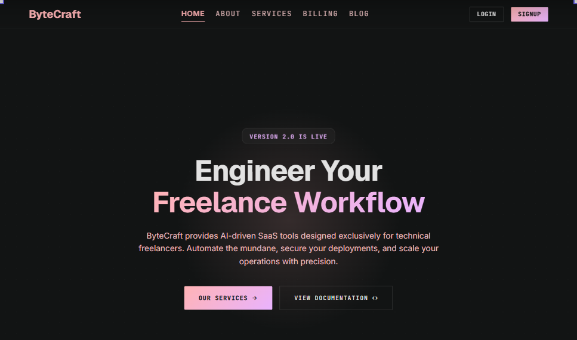
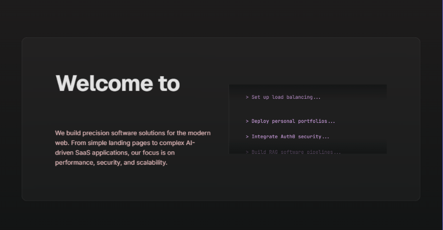
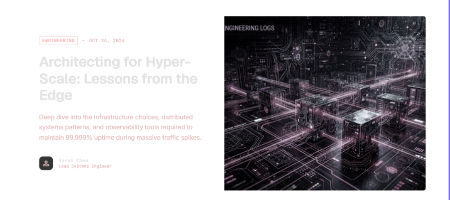
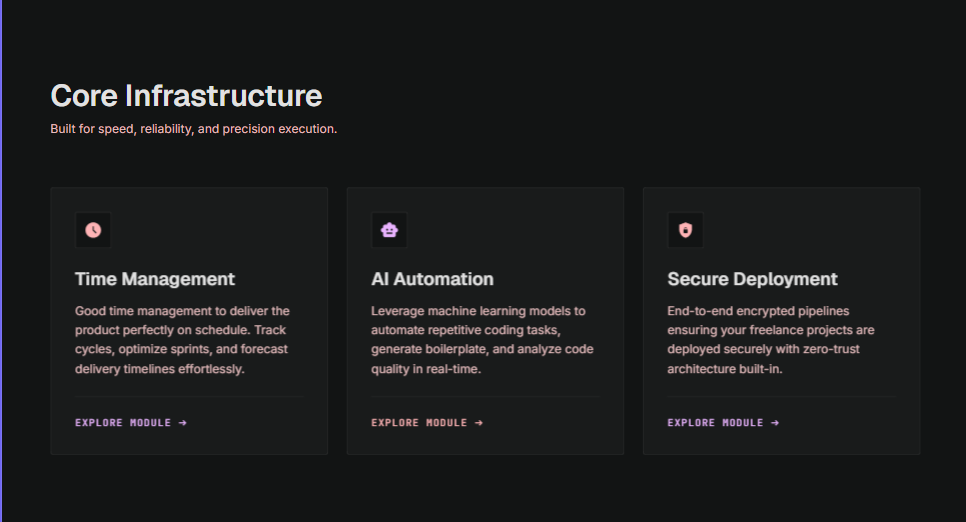
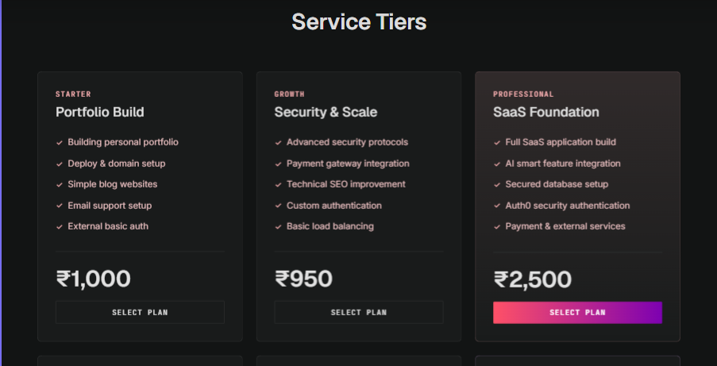
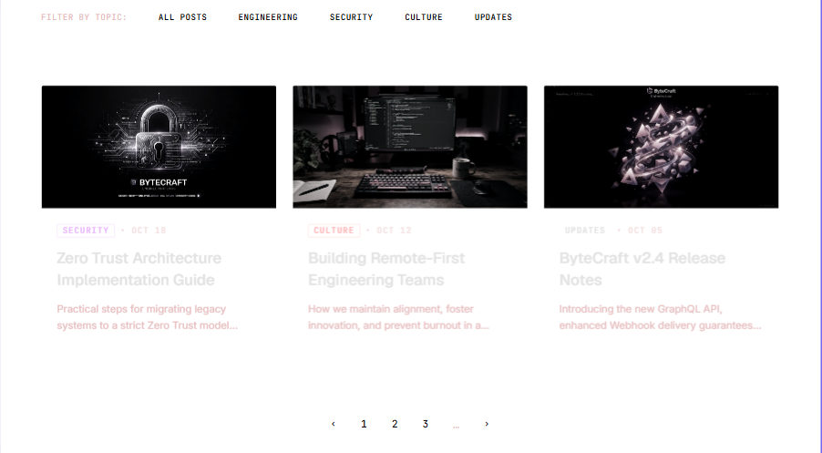

<div align="center">

# **ByteCraft**

### AI-Driven SaaS for Technical Freelancers

*One Workspace. Endless Possibilities.*

[](https://nextjs.org)
[](https://react.dev)
[](https://convex.dev)
[](https://tailwindcss.com)
[](https://typescriptlang.org)
[](https://bun.sh)
[](https://docker.com)

<br/>

ByteCraft provides AI-driven SaaS tools designed exclusively for technical freelancers. Automate the mundane, secure your deployments, and scale your operations with precision.

</div>

---

## Preview

<table>
<tr>
<td align="center"><strong>Homepage</strong></td>
<td align="center"><strong>Services</strong></td>
<td align="center"><strong>Contact</strong></td>
</tr>
<tr>
<td></td>
<td></td>
<td></td>
</tr>
<tr>
<td align="center"><strong>Features</strong></td>
<td align="center"><strong>Pricing Tiers</strong></td>
<td align="center"><strong>Blog Feed</strong></td>
</tr>
<tr>
<td></td>
<td></td>
<td></td>
</tr>
</table>

---

## Features

- **AI-Powered Automation** — Leverage machine learning to automate repetitive coding tasks, generate boilerplate, and analyze code quality in real-time
- **Secure Deployment Pipelines** — End-to-end encrypted pipelines with zero-trust architecture for freelance project deployments
- **Service Tier Management** — Six pricing tiers from essential web apps to enterprise mobile ecosystems with integrated payment flows
- **Engineering Blog** — Topic-filtered article grid with featured posts, pagination, and responsive layouts
- **Contact & Feedback System** — Form submissions stored in Convex and instantly emailed via Resend
- **Dark/Light Theme** — OS-aware theme toggle with smooth transitions and persistent preferences
- **Responsive Design** — Mobile-first layouts with animated navigation, scroll reveals, and entrance effects

---

## Tech Stack

| Layer | Technology |
|---|---|
| Framework | [Next.js 16](https://nextjs.org) (App Router, Turbopack) |
| UI | [React 19](https://react.dev), [Tailwind CSS v4](https://tailwindcss.com), [shadcn/ui](https://ui.shadcn.com) |
| Animations | [GSAP](https://gsap.com), [Motion](https://motion.dev) |
| Database | [Convex](https://convex.dev) (hosted serverless) |
| Email | [Resend](https://resend.com) |
| Icons | [Lucide React](https://lucide.dev) |
| State | [Zustand](https://zustand-demo.pmnd.rs), [TanStack Query](https://tanstack.com/query) |
| Build | [Bun](https://bun.sh), [TypeScript](https://typescriptlang.org) |
| Deploy | [Docker](https://docker.com) (multi-stage build) |

---

## Quick Start

### Prerequisites

- [Bun](https://bun.sh) v1.3+
- A [Convex](https://convex.dev) account (free tier works)
- A [Resend](https://resend.com) API key (for contact/feedback emails)

### 1. Clone & Install

```bash
git clone https://github.com/your-username/my-saas.git
cd my-saas
bun install
```

### 2. Environment Setup

```bash
cp .env.example .env.local
```

Fill in your keys in `.env.local`:

```env
NEXT_PUBLIC_CONVEX_URL=https://your-deployment.convex.cloud
CONVEX_DEPLOYMENT=your-deployment-id
NEXT_PUBLIC_CONVEX_SITE_URL=https://your-deployment.convex.site
RESEND_API_KEY=re_your_key_here
```

### 3. Start Development

```bash
bun run dev
```

Open [http://localhost:3000](http://localhost:3000).

---

## Project Structure

```
my-saas/
├── app/                    # Next.js App Router routes
│   ├── page.tsx            # Home (hero, features, blog feed)
│   ├── about/page.tsx      # About page
│   ├── services/page.tsx   # Pricing tiers & engineering blog
│   ├── contact/page.tsx    # Blog + contact form + feedback
│   └── api/
│       ├── contact/route.ts   # Resend — contact submissions
│       └── feedback/route.ts  # Resend — feedback messages
├── components/             # Shared React components
│   ├── Navbar.tsx          # Fixed top navigation
│   ├── Footer.tsx          # Site footer
│   ├── providers.tsx       # Convex + TanStack Query providers
│   └── ui/                 # shadcn/ui primitives
├── convex/                 # Convex backend
│   ├── schema.ts           # Database schema (contactSubmissions)
│   ├── contacts.ts         # Mutation: submitContact
│   └── _generated/         # Auto-generated types & API
├── JsonDB/                 # Static data (services, nav, home)
├── lib/                    # Utilities, hooks, stores, animations
├── public/                 # Static assets
├── UI-Design/              # Design mockups & screenshots
├── Dockerfile              # Multi-stage Docker build
├── docker-compose.yml      # Docker Compose config
└── package.json
```

---

## Docker Deployment

### Build & Run

```bash
# Copy env for Docker Compose
cp .env.local .env

# Build and start
docker compose up --build -d
```

The app runs on [http://localhost:3000](http://localhost:3000).

### Verify

```bash
docker compose ps        # Check container status
docker compose logs -f   # Stream logs
```

---

## Environment Variables

| Variable | Required | Description |
|---|---|---|
| `NEXT_PUBLIC_CONVEX_URL` | Yes | Convex deployment URL (client + build) |
| `CONVEX_DEPLOYMENT` | Yes | Convex deployment ID (used by CLI) |
| `NEXT_PUBLIC_CONVEX_SITE_URL` | Yes | Convex site URL (for server functions) |
| `RESEND_API_KEY` | Yes | Resend API key for transactional email |
| `PORT` | No | Port override (default: `3000`) |

> **Note:** `NEXT_PUBLIC_*` variables are inlined into client bundles at build time. They must be available during `bun run build` (or Docker build).

---

## Scripts

| Command | Description |
|---|---|
| `bun run dev` | Start development server (Turbopack) |
| `bun run build` | Production build |
| `bun run start` | Start production server |
| `bun run lint` | Run ESLint (flat config) |
| `bunx tsc --noEmit` | Type-check without emitting |

---

<div align="center">

**Built with precision by ByteCraft**

*Automate the mundane. Scale with precision.*

</div>
